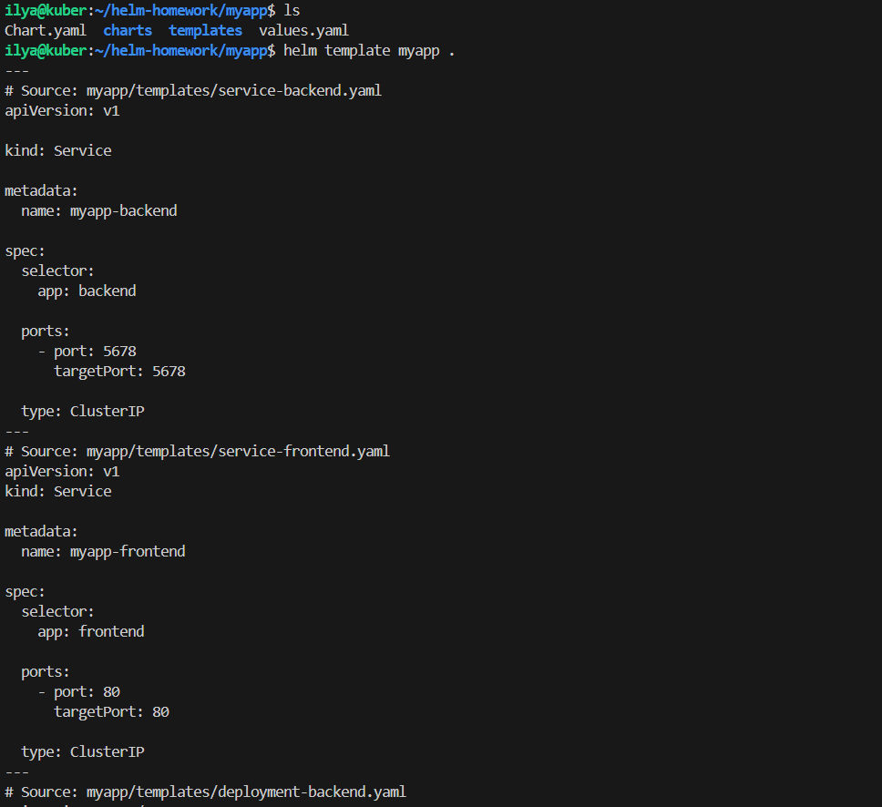
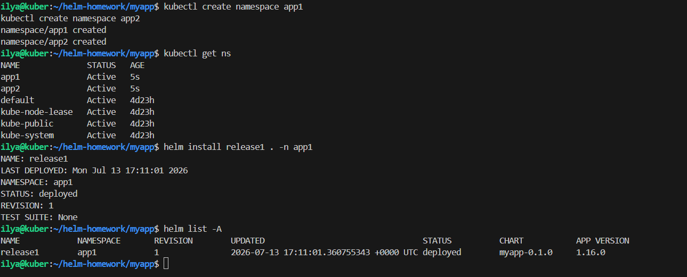
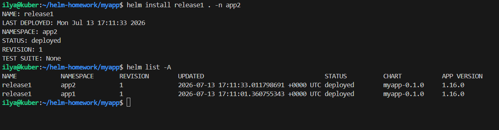
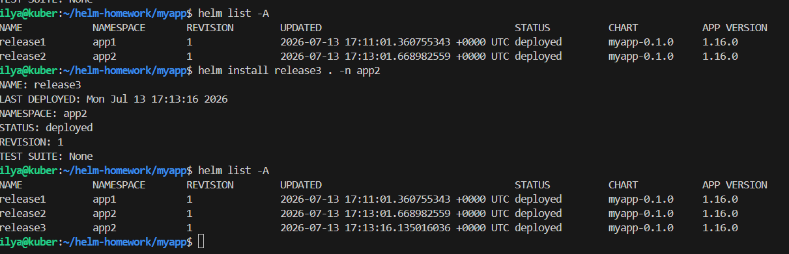
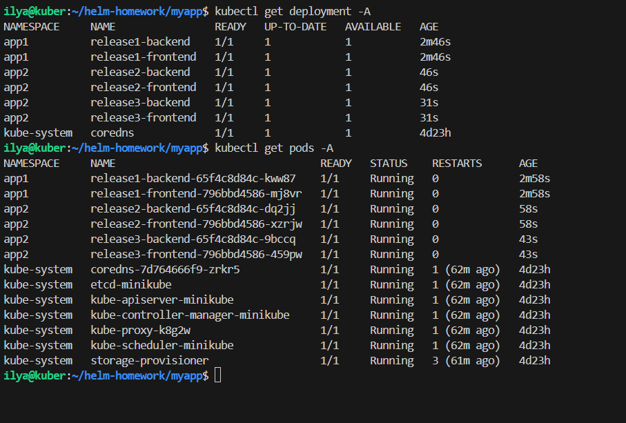
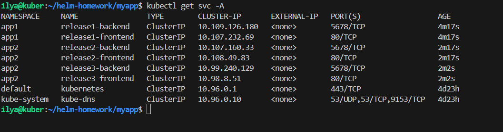
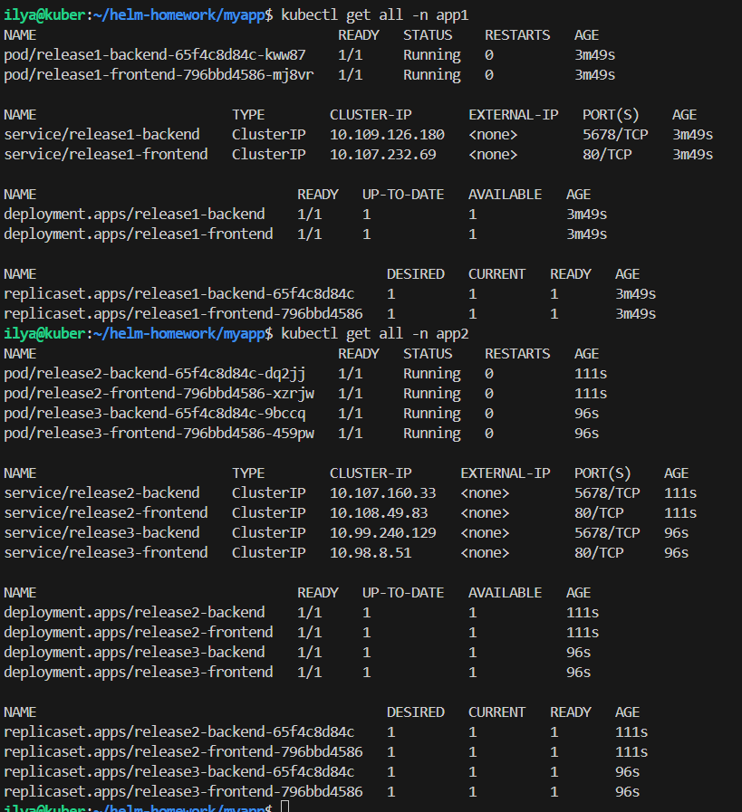

# helm# Домашнее задание к занятию «Helm»

## Цель работы

Подготовить собственный Helm Chart для приложения и развернуть несколько экземпляров приложения в разных пространствах имен Kubernetes.

---

# Задание 1. Подготовка Helm Chart

Создан новый Helm Chart:

```bash
helm create myapp
```

Из шаблона были удалены ненужные файлы и подготовлена собственная структура приложения.

Структура проекта:

```text
myapp/
├── Chart.yaml
├── values.yaml
└── templates/
    ├── _helpers.tpl
    ├── deployment-backend.yaml
    ├── deployment-frontend.yaml
    ├── service-backend.yaml
    └── service-frontend.yaml
```

Приложение состоит из двух компонентов:

- Frontend (Deployment + Service)
- Backend (Deployment + Service)

Версии контейнеров вынесены в `values.yaml`.

Проверка корректности Helm Chart:

```bash
helm lint .
```

Просмотр сгенерированных Kubernetes-манифестов:

```bash
helm template myapp .
```

**Результат:**



---

# Задание 2. Развертывание приложения

Созданы пространства имен:

```bash
kubectl create namespace app1
kubectl create namespace app2
```

Развернуты три экземпляра приложения.

Первый экземпляр:

```bash
helm install release1 . -n app1
```

Второй экземпляр:

```bash
helm install release2 . -n app1
```

Третий экземпляр:

```bash
helm install release3 . -n app2
```

---

## Проверка Helm Releases

```bash
helm list -A
```

---

## Проверка Deployment

```bash
kubectl get deployment -A
```

---

## Проверка Pod

```bash
kubectl get pods -A
```

---

## Проверка Service

```bash
kubectl get svc -A
```

---

## Проверка namespace app1

```bash
kubectl get all -n app1
```

---

## Проверка namespace app2

```bash
kubectl get all -n app2
```

Скриншоты: 








---

# Итог

В ходе выполнения работы:

- установлен и проверен Helm;
- создан собственный Helm Chart;
- приложение разделено на два независимых компонента;
- параметры образов вынесены в `values.yaml`;
- развернуты три экземпляра приложения;
- выполнено развертывание в двух различных namespace;
- корректность установки подтверждена средствами `kubectl` и `helm`.
